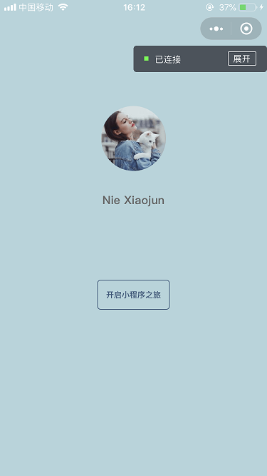
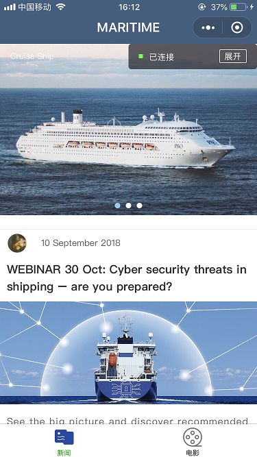
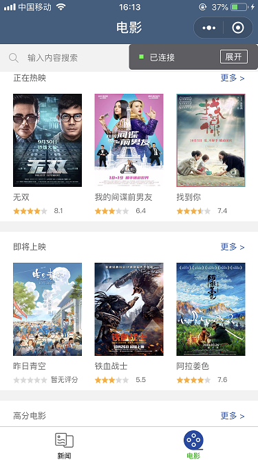
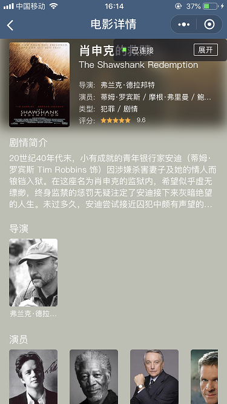

此微信小程序主要包含两类页面：新闻和电影页面。 
+ 新闻页面的数据来自本地 js 文件；
+ 电影页面的数据使用了豆瓣提供的 API。

微信扫面下方的程序码即可进入小程序。 

### 1. 起始页面

进入小程序首先会看到起始页面。 

### 2. 新闻首页

点击起始页面中的"开启小程序之旅"按钮后，进入新闻首页。 

点击页面中的新闻后，跳转至新闻详情页面。

### 3. 电影首页

点击页面下方的 tab 栏中的"电影"，切换至电影首页。 

+ I) 点击电影首页中的"更多"，可以跳转至更多电影页面 
  

+ II) 在电影首页的搜索框中输入内容并确认后，页面将显示搜索结果。 
  

  清空搜索框中的内容后，页面将变回电影首页。
+ III) 在上述几个界面中，点击任一电影后，将跳转至该电影的详情页。 
  

# douban
