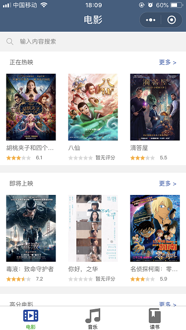
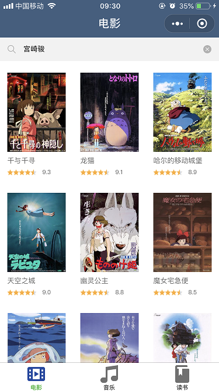
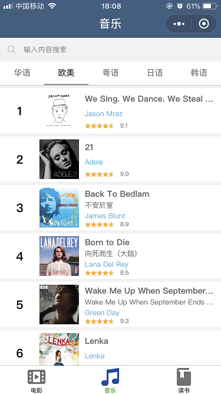
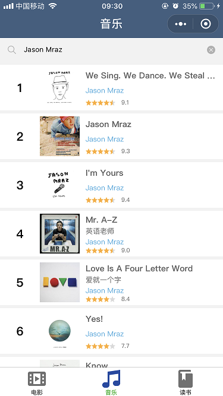
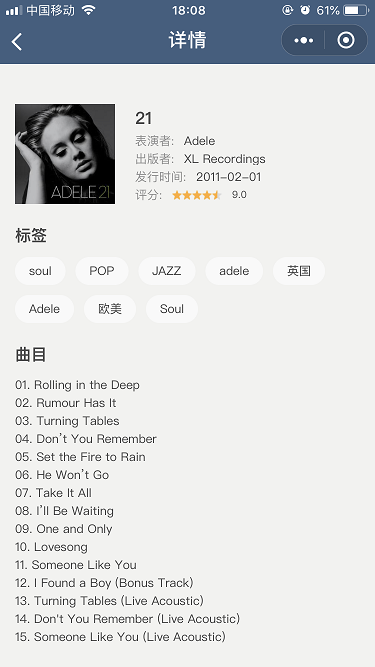
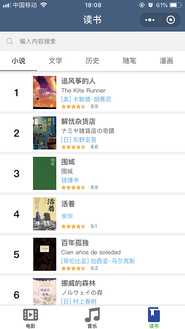
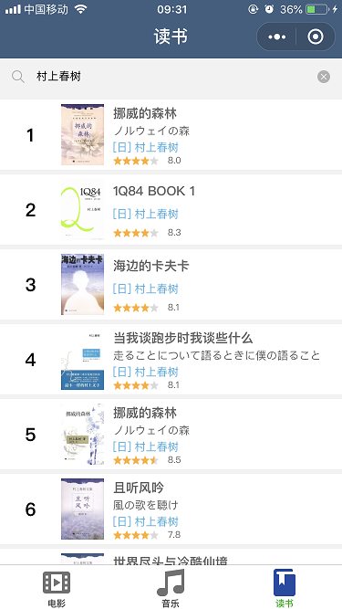
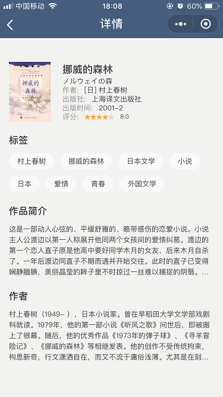

此微信小程序包含三个页面：电影、音乐和读书。所有数据来自豆瓣提供的 API。 

使用微信扫描下方的程序码即可进入小程序。 

### 1. 电影页面

电影首页。 

点击电影首页中的"更多"，可以跳转至更多电影页面。 

在电影首页的搜索框中输入内容并确认后，页面将显示搜索结果。 

在上述几个界面中点击电影后，将跳转至该电影的详情页。 

### 2. 音乐页面

音乐首页。 

在音乐首页的搜索框中输入内容并确认后，页面将显示搜索结果。 

在上述几个界面中点击音乐后，将跳转至该音乐的详情页。 

### 3. 读书

读书首页。 

在读书首页的搜索框中输入内容并确认后，页面将显示搜索结果。 

在上述几个界面中点击图书后，将跳转至该图书的详情页。 

